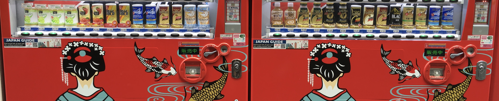
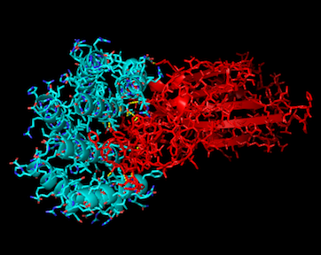

---
# Feel free to add content and custom Front Matter to this file.
# To modify the layout, see https://jekyllrb.com/docs/themes/#overriding-theme-defaults

layout: home
---

----

## COVID-19

- Help in the fight against COVID-19 by sharing your idle personal computer resources.
- [Join Rosetta@home](https://boinc.bakerlab.org): Make sure to turn off your VPN when joining.

## Presentations

### 2020: [Data Privacy (Privacy Preserving Machine Learning)](../Data_Privacy_2020_Didier_Guillevic.pdf)

### 2020: [Password Cracking (Adopting a reasonable password hygiene)](../Password_Cracking_2020_Didier_Guillevic.pdf)

### 2019: [Deep Learning](../Deep_Learning_2019_Didier_Guillevic.pdf)  ([ICPRAI 2018](http://www.icprai2018.com), updated 2019-11)

